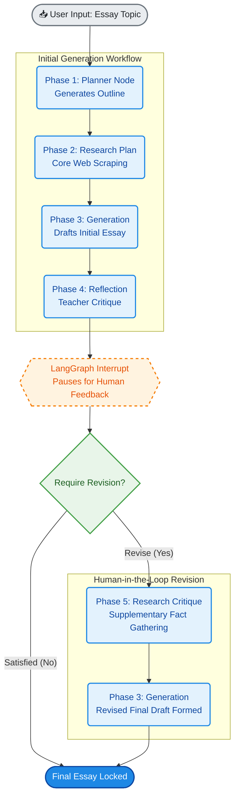

# 📝 AI Automated Essay Writer (LangGraph & Streamlit)
An autonomous multi-agent essay-writing workflow that simulates the real-world writing process: outline planning, extensive web research, initial drafting, and professional academic critique, culminating in an interactive human-in-the-loop revision cycle.

Built using LangGraph for state management, Streamlit for the frontend interface, LangChain / Groq (Llama 3.3 70B) for specialized agent nodes, and Tavily AI for real-time internet search gathering.

## 🚀 Key Features
Autonomous Multi-Agent Collaboration: Divides the complex task of essay writing into distinct, specialized role-based agents (Planner, Researcher, Writer, and Teacher).

Stateful Orchestration: Utilizes LangGraph to pass context dynamically between agents while avoiding infinite loops.

Human-in-the-Loop Interruption: Automatically pauses execution after Phase 4 (Teacher's Critique), allowing users to review the initial output and explicitly opt-in or out of a revision stage.

Strict Single-Revision Cap: Built-in safeguards allow exactly one advanced structural revision session based on user consent before automatically freezing outputs and resetting for a new topic.

Persistent Session Cache: Implements LangGraph’s MemorySaver checkpointer ensuring historical states persist gracefully across Streamlit's structural reruns.

## 🔬 Agent Architecture & Workflow
The system progresses through a highly structured 5-Phase architecture:

- Phase 1: Essay Plan Outline Generated (planner) – Analyzes the prompt and generates a high-level logical structure with specific section-by-section directions.

- Phase 2: Core Research Gathering Complete (research_plan) – Generates target search queries to scrape real-time context and facts via the Tavily API.

- Phase 3: Essay Draft Formed (generate) – Synthesizes the outline plan and researched facts into a coherent 5-paragraph essay draft.

- Phase 4: Teacher's Reflection & Critique (reflect) – Acts as an academic supervisor, analyzing the draft's depth, tone, and stylistic execution, outputting actionable improvement points.

- Phase 5: Supplementary Research via Critique Feedback (research_critique) – If the user approves a revision, this node searches the web again exclusively to patch structural gaps found by the critique before sending the data back to Phase 3 for the final revision output.

## 🛠️ Tech Stack
- Frontend: Streamlit

- Agent Framework: LangGraph & LangChain Core

- LLM Engine: Groq Cloud API (utilizing llama-3.3-70b-versatile)

- Search Engine: Tavily AI

## Web App SS

